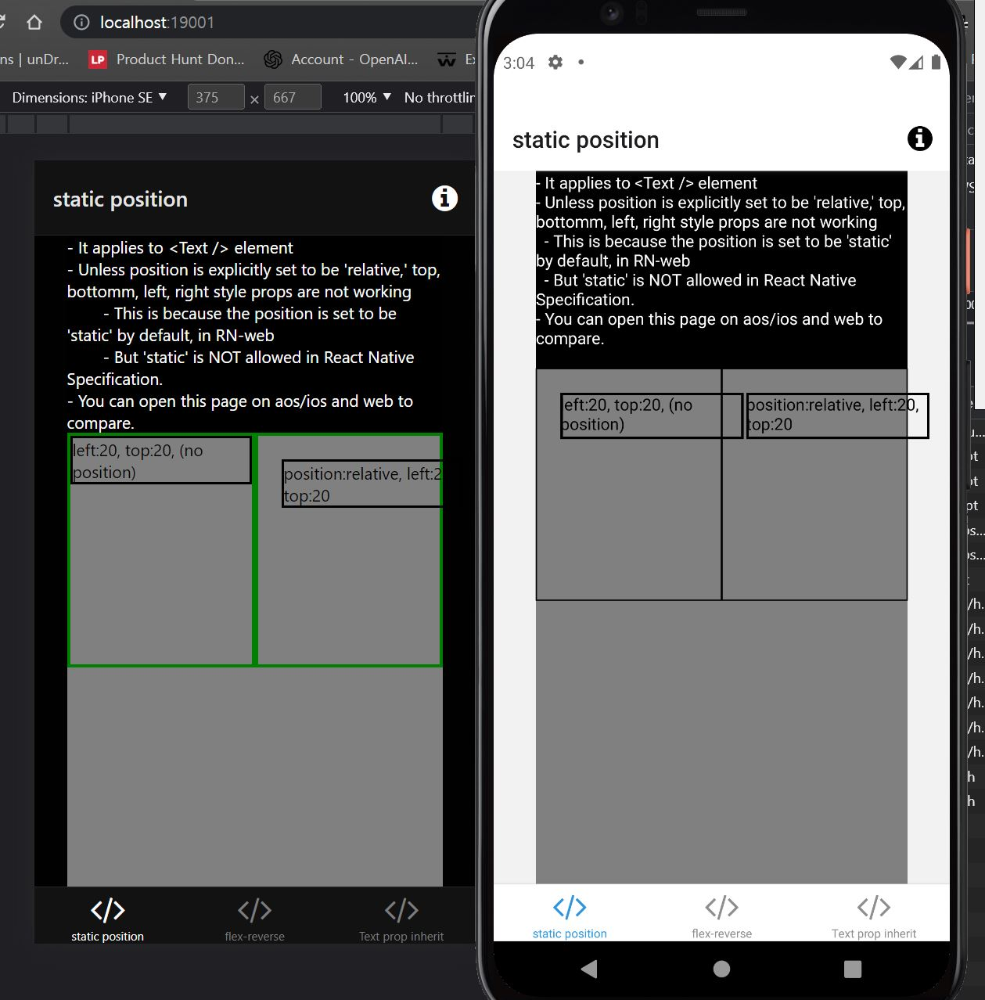
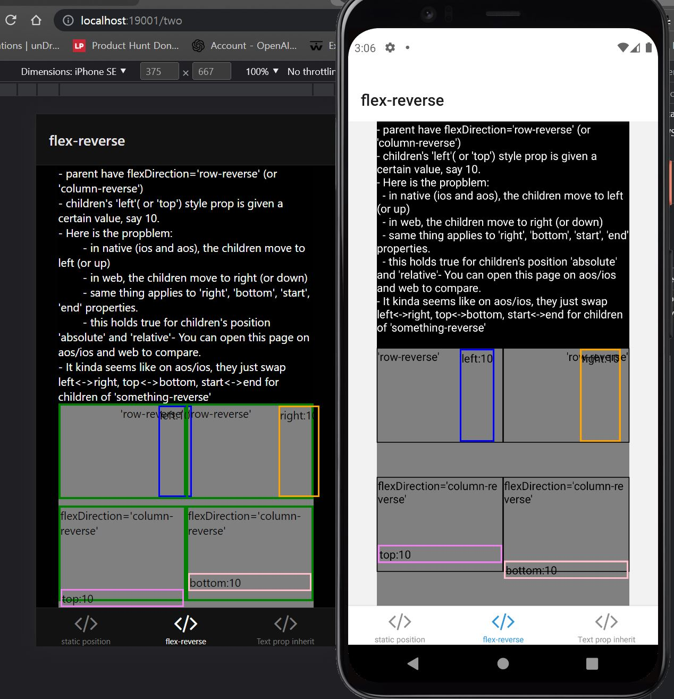
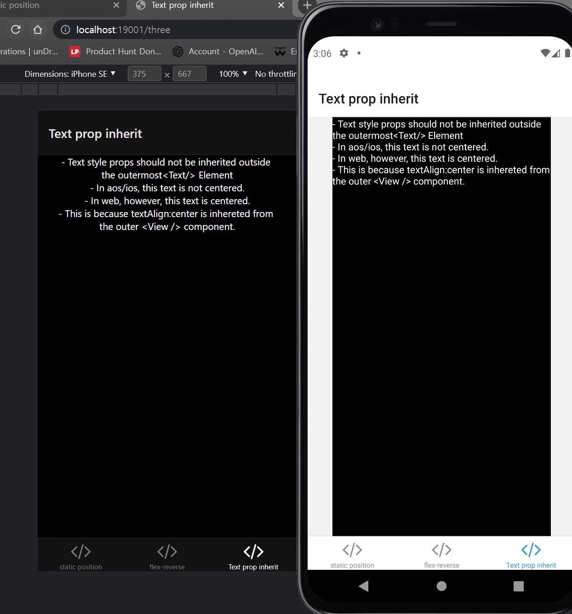

# React Native UI Inconsistencies
This repository demonstrates inconsistencies in React Native UI between Android, iOS, and web platforms.

## Problems

1. **`<Text/>` element default prop issue**: The `<Text/>` element has `position: 'static'` as a default prop, which is not allowed in the React Native specification.

2. **`flexDirection` and position properties inconsistency**: If a parent element has `flexDirection: 'row-reverse'` or `flexDirection: 'column-reverse'`, the `left`, `right`, `top`, `down`, `start`, and `end` properties behave differently on Android/iOS compared to web.

3. **`<Text/>` component style inheritance**: The `<Text/>` component should not inherit styles from its parent elements, but it does on web platforms.

## How to run

Simply clone and run 'yarn web', then open in browser AND in ios/android to compare.